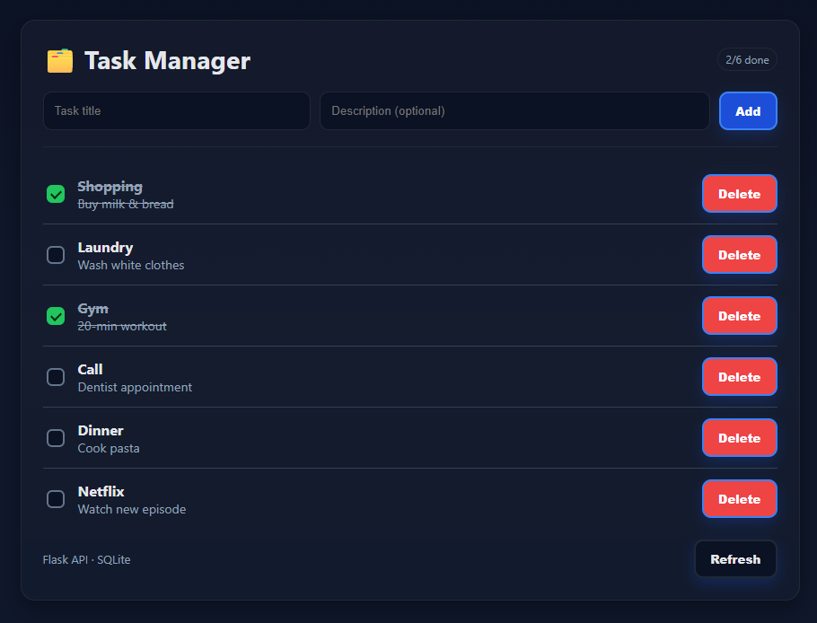

# 📝 Fullstack Task Manager

A simple **full-stack task management app** with Flask (backend) and React (frontend).  
Users can add, update, mark as done, and delete tasks — with a clean UI and persistent storage.

---

## 🚀 Features
- Backend: Flask REST API with full CRUD
- Database: SQLite via SQLAlchemy ORM
- Frontend: React + Vite, modern component-based UI
- Styling: Custom CSS (dark theme)
- CORS enabled for client-server communication

---

## 📂 Project Structure
```
fullstack-task-app/
├─ backend/        # Flask API (Python)
│  ├─ app.py
│  └─ models.py
├─ frontend/       # React + Vite (JS)
│  ├─ public/
│  └─ src/
│     ├─ components/
│     ├─ App.jsx
│     └─ main.jsx
└─ README.md

```

---

## 🛠️ Tech Stack
- **Backend**: Python, Flask, Flask-SQLAlchemy, Flask-CORS, SQLite  
- **Frontend**: React, Vite, Fetch API, HTML/CSS  
- **Tools**: Node.js, npm, Git

---

## ⚙️ Setup

### 1. Backend
```bash
cd backend
pip install -r requirements.txt
python app.py
```
Runs API at: http://127.0.0.1:5000

### 2. Frontend
```bash
cd frontend
npm install
npm run dev
```
Runs client at: http://localhost:5173

#### Access from phone on same Wi-Fi (optional):
- Run frontend with host: npm run dev -- --host
- Run backend with: app.run(host="0.0.0.0", port=5000, debug=True)
- Update src/config.js to use your machine IP, e.g. http://192.168.1.23:5000.

## 📸 Screenshot



## 🔮 Future Work 
- Inline editing of task title/description
- Filters & search (e.g., show only open tasks)
- Tests (Pytest for backend, React Testing Library for frontend)
- Dockerization and simple deployment (Render for backend, Netlify for frontend)

## 👤 Author
**Matanya Kedem**

[LinkedIn](https://www.linkedin.com/in/USERNAME) • [GitHub](https://github.com/USERNAME)

